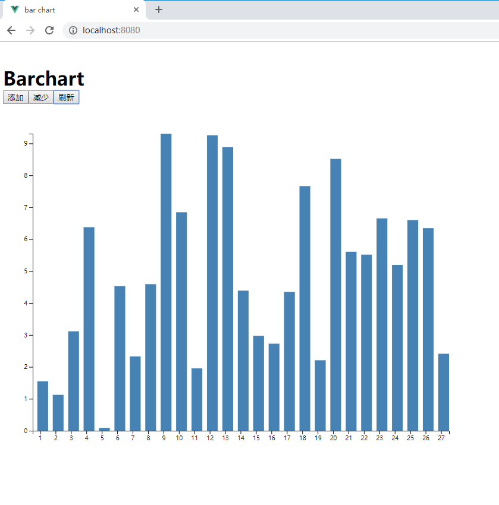

### 第五次作业

### 一. 概述

作业使用Vue.js和d3.js

- 完成了作业要求，可以进行数据的更新和增删。
- 抽离出了柱状图组件。

### 二. 目录结构

作业的目录结构如下

```shell
dir
├─dist						# 编译出的版本
│  ├─css
│  └─js
├─public
├─screenshots
└─src
    ├─assets
    ├─components				
    │  └─Barchart			  # 柱状图组件
    │      └─components
    └─router
```

### 三. 测试结果

如图使用d3.js绘制的一个柱状图。可以进行增删和刷新。  




### 四. 运行测试

根目录下调试

```shell
npm install
npm run serve
```

