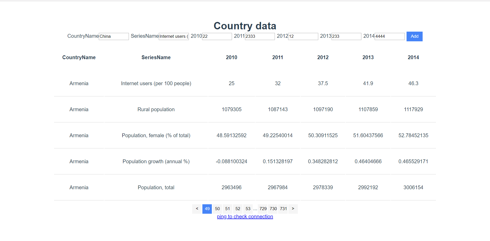

### 第五次作业



分页展示数据+向csv文件写入数据，分页、其实有一点问题= =

### 一. 目录结构

作业的目录结构如下

```shell
dir
├─coun						# 前端部分
│  ├─dist					# 编译结果
│  │  ├─css
│  │  └─js
│  ├─public
│  └─src
│      ├─assets
│      ├─components
│      │  ├─Country			 # 核心组件
│      │  │  └─components
│      │  └─Ping
│      └─router
├─screenshots
└─try						# 后端部分
    ├─data
    └─try
        └─__pycache__
```

### 二. 运行测试

前端`coun` 目录下调试

```shell
npm install
npm run serve
```

也可在`coun/dist`目录下使用`http-server` 命令直接运行查看编译后的网页。

后端部分在`try.ps1` 中提供了powershell命令，如下

```powershell
python -m venv venv
.\venv\Scripts\activate 
pip install -e .
$env:FLASK_ENV="development"
$env:FLASK_APP="try"
flask run
```


