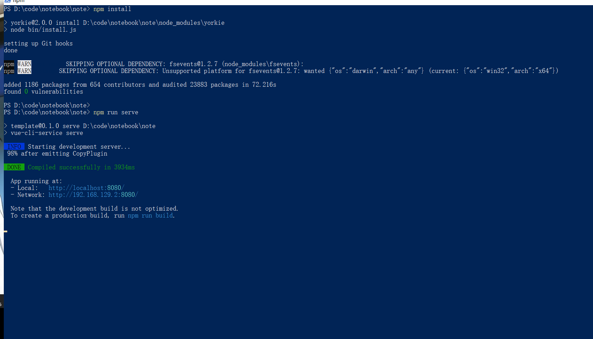
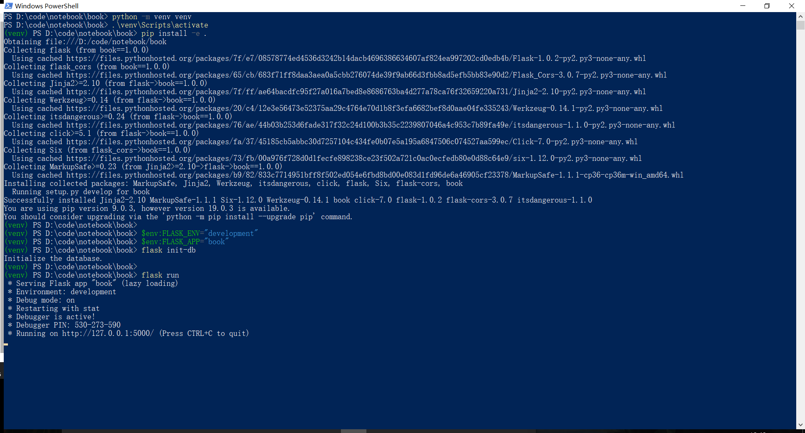

### Notebook

### 一. 概述

本次作业基于Vue.js和Flask构建

### 二. 目录结构

```shell
├─notebook 
    ├─book 						# 后端目录
    │  ├─book
    │  │  └─__pycache__
    │  └─instance
    ├─note 						# 前端目录
    │  ├─dist 					# 编译结果
    │  │  ├─css
    │  │  └─js
    │  ├─public
    │  └─src					# 源码目录
    │      ├─assets	
    │      ├─components
    │      │  ├─Notebook 		# Notebook页面
    │      │  │  └─components 	 # Notebook相关组件
    │      │  └─Ping 			# Ping页面
           └─router				# 路由目录
```

### 三. 运行测试

具体运行方式可以参考下面两个截图（powershell）。





